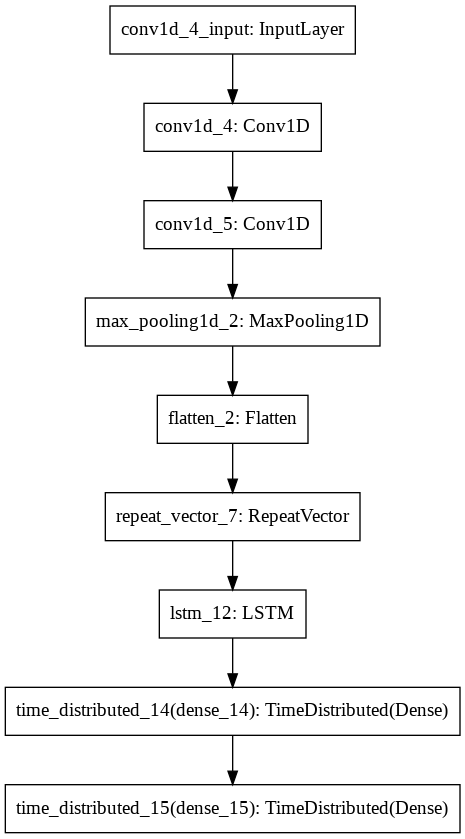

Electricity price forecasting using RNN
===================
`#DataScience` `#Python` `#DeepLearning` `#Electricityprice` `#Forecast` `#RNN`

## Objetive ##

The main objective of this project is to create an electricity price forecasting for the next 6-12 hours using neural
networks, more specifically Recurrent Neural Networks (RNN).

The **scope of the project** is to provide a more complete and accurate way of predict electricity pricing by applying 
deep learning and artificial intelligence knowledge acquired in KSchool Master in Deep Learning and Artificial 
Intelligence.

## About the methodology ##
Recurrent Neural Network (RNN) is a neural network that integrates feedback loops, allowing information persists 
during some steps or times of training, (epochs) through connections from the outputs of the layers, which 
"embedding" their results in the input data. The connections between the nodes form a graph that is plotted along a 
time sequence. It works like a network with multiple copies of itself, each with a message to its successor. 
They are applied in lists and temporary data.  
  

### Data acquisition

Data has been obtained from REE, a multinational business group of Spanish origin that operates in the international 
electricity market as an electricity system operator. They provide an API REST service to ESIOS (System Operator 
Information System),by using this service, you can download all the information in the system. The official 
documentation of the ESIOS API REST is available [here](https://api.esios.ree.es/).

To access the system, it is necessary to request a token by email. Information about how to order the token is 
available [here](https://www.esios.ree.es/es/pagina/api).

To get the information the [`esios.py`](esios.py) file has been developed. In it you can use "save_indicators_table" function to 
check all indicators list. 
When the Daily Market Price is set, some of the factors that most affect are:
* **Electricity demand**: The total energy consumption for all purposes. The larger the electricity demand, the higher 
the Market Price will be.
* **Renewable energy generation**: Renewable energy have priority in the power grid and therefore always come first in the
 merit order. The larger of renewable energy generation, the lower the Market Price will be.
* **Date and time**: The Market Price will be increased in summer and winter, in addition peak values usually take place 
in the early morning and late afternoon.

| Indicator name | Indicator number | alias |
| --- | --- | --- |
| Previsión diaria de la demanda eléctrica peninsular | Id: 460 | demand |
| Previsión de la producción eólica nacional peninsular | Id: 541 | wind |
| Generación prevista Solar | Id: 10034 | solar |
| Precio medio horario componente mercado diario | Id: 805 | price |

The data available is from 01-01-2014 till present. The historical data used is from 01-01-2014 to 25-08-2020

In this way, information can be downloaded through the REST API service. Since the Electric Market Price is a value that
 is updated hourly, to develop the model it’s necessary that the rest of the parameters maintain the same scale, so the 
 script is configured to perform the data download of the indicators previously mentioned with hourly frequency. 

To obtain the information from ESIOS, it is necessary to execute the Jupyter Notebook file 
[`Get_Data.ipynb`](Get_data.ipynb). Once the file is executed a **'Data.csv'** file will be generated  

The files obtained have a similar structure, formed by two fields:

| Date | demand | solar | wind | price |
| --- | --- | --- | --- | --- | 
| Timestamp | Value | Value | Value | Value |

#### Preprocessing
Preprocessing is divided in two parts, one make at [`Get_Data.ipynb`](Get_data.ipynb), which consist in drop duplicates,
clean NaN and merge the dataset in only one dataframe and export. Also includes an outliners study which concludes in 
not being significant values, so they are ignored:

| Variable | demand | solar | wind | price |
| --- | --- | --- | --- | --- | 
| **Outliners** | 0 | 403 | 506 | 1609 |
| **%** | 0 | 0.707% | 0.888% | 2.81% |

The second preprocessing part is done before modelling at [`model_deep_price.ipynb`](model_deep_price.ipynb). Besides 
the normalization of data for use in the neural network, the "Date" column has been modified to make it a usable signal.
Taking into account that the electric price is highly influenced by the daily and annual periodicity, we have 
transformed to annual and daily sinus and cosine signal dates. 

### Modelling
In the model part, a study with different configurations and methods has been carried out. It is basically divided into
2 methodologies with different configurations: 
 1. **Univariate time series**
    * Baseline
    * RNN- LSTM Model
 2. **Multivariate time series**
    * Single-Step Model
    * Multi-step Model 

Finally the selected model to make final predictions and save was the Multi-step model with the following configuration:

**Files**:

1. [`model_deep_price.ipynb`](model_deep_price.ipynb): a Jupyter Notebook with the study of different models and the 
development of the best fit model using RNN

### Prediction and visualization

The last phase in this project was trying to communicate information clearly and efficiently through plotting the 
results. For that the [`deep_price.py`](deep_price.py) uses `streamlit`. There automatically gets today date, and 15 
days before in order to make a prediction based on the LSTM model with the best accuracy run in 
[`model_deep_price.ipynb`](model_deep_price.ipynb)

 
## About the technology ##
#### Programming languages and interpreters

 - **Linux shell**: Shell was used intensively to manage files and run scripts.
 - **Pycharm**: IDE used to create .py files
 - **Python**  language. 

#### Main libraries

 - `TensorFlow`:The model and data are prepared to work with CPU, so it is not required GPU.
 
         > pip install tensorflow
 
  - `Streamlit`:
  
         > pip install streamlit
  
 - `Pandas`
 - `Numpy` 
 - `matplotlib.pyplot`
 
#### Hardware and Resources

 - DELL Optiplex GX 7010 Intel Core i5-3470, 8GB de RAM, Disc SSD  240GB

## How to run this analysis

**Generate training Dataset**

        > jupyter-notebook Get_data.ipynb
    

**Modelling** 

        > jupyter-notebook model_deep_learning.ipynb 
    
**Running prediction APP** 

        > streamlit run prediction.py 
    
## About the author

**Clara Godoy**
Analyst and Developer at [Maxam Int. Corp.](https://www.maxamcorp.com/)
 - Linkedin: [@claragodoy](https://www.linkedin.com/in/claragodoy/)
 - Twitter: [@clagodmor](https://twitter.com/clagodmor)